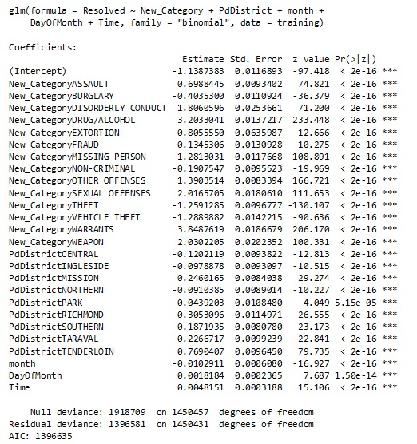
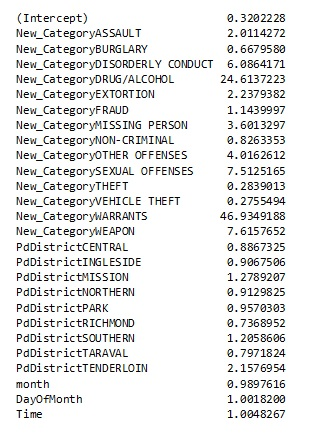
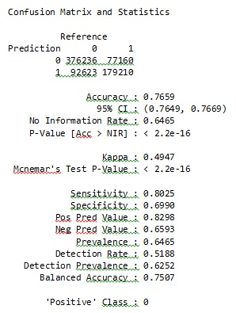
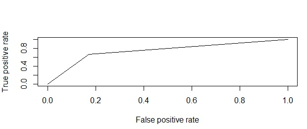

```{r setup, include=FALSE}
library(knitr)
knitr::opts_chunk$set(echo = FALSE, cache = TRUE)
```

### Machine Learning

We use the `incidents_new_categories` dataframe to build a logistic model to predict if an incident would be resolved by a Police department, given its category (first problem statement). The column `Resolution` is the response variable. This column is coded as `0` if the resolution provided is "NONE" and `1` for all others. It is then saved in a new column called `Resolved`. The column `Resolved`is converted into factor. 

The ratio of resolved versus unresolved cases is 1:1.6 indicating that this is a fairly balanced dataset. Moreover, the large number of observations ensures that the training samples spans the entire feature space resulting in a robust model. 

The dataset is partitioned into `training` and `testing` sets. The training set contains 70% and the testing set contains 30% of the data. The training set is used to build a logistic regression model to predict the response, `Resolved`, as a function of five predictors namely, `New_Category, PdDistrict, month, DayOfMonth and Time`. 

The `glm` function is used with a `binomial` family (error distribution) since the response is binary. Results from the model are shown below. 



The estimates from the model provide a relationship between the predictor variables and the response. The coefficients are in the form of *logits*. These are converted into *log-odds* for easy interpretation as shown in the image below. The log-odds is calculated by taking the exponential value for the coefficients of each predictor variable. It can be seen that **Theft** and **Vehicle Theft** have the least chance of being resolved by the police.  From the odds-ratio table below it is seen, that for every unit increase in **Theft** and **Vehicle Theft**, the log-odds of the SFPD resolving the case changes only by 0.284 and 0.275 units when compared to **Warrants** which has a log-odds valus of 46.934. For PdDistricts **Southern, Mission and Northern**, where density of crime is high, the log-odds values are 1.205, 1.279 and 0.913 units respectively which is fairly lower than  **Tenderloin** which has the highest log-odds of 2.157. The log-odds value for **DayOfMonth, Time and Month** also change by 1.001, 1.004 and 0.99 respectively. It can be noted that all the 5 predictors are equally significant in this model.




Various models were built using different sets of predictors. AIC was used as the metric to determine the best model. The AIC value for the model obtained above was the lowest and was therefore chosen as the champion model. A model with a lower AIC is always considered a better one. 

Now this model is used on the testing data and its performance is evaluated. Results of the confusion matrix are shown below. The probability threshold value is set as 0.5. A sensitivity value of 0.80 and a specificity value of 0.69 is achieved along with an accuracy of 0.766.



The receiving operating characteristic, ROC, is a measure of classifier performance. To calculate area under curve (AUC), ROC curve is generated by plotting false positive rate against true positive rate (plot below). The AUC for this model is calculated as 0.745. Hence, it does a fairly good job at discriminating between two categories in the response variable.


